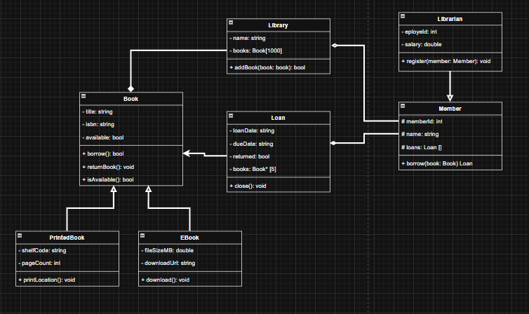

# Part 1:

## 1. + 2.
 ### Library
public addbook(Book)

### Member
public borrow(Book)

### Librarian
public salary  
___
public register(Member)

### Loan
? loanDate  
___  
public close()

### Book
public title  
public isbn  
public available  
___
public borrow()

### PrintedBook
public printLocation()

### EBook
public download()

## 3.
__PrintedBook__, __EBook__ extends __Book__  
__Librarian__ extends __Member__

## 4.

### Composition
__Library__ ownes __Book__  
__Loan__ ownes __Book__

### Aggregation
__Member__ is part of __Library__

### Association
None

### Unclear
__Member__ ? __Loan__  
__Library__ ? __Librarian__

# Part 2:
## 1.
### Correct
__Book__ owned by __Library__   
__Library__ has an attribute, which stores books

Inheritance is used correctly

## 2.
### Incorrect
__Member__ is part of __Library__  
None of these two have a way of storing information about each other
___
__Book__ is owned by __Loan__  
This relationship is nonsense, the __Book__ is owned by the __Library__ and should not be owned by a __Loan__  
Also arrows should not cross and can't go through other classes
___ 
__Library__ and __Librarian__  
This relationship is unclear
___
__Loan__ and __Member__  
This relationship is unclear

## 3.
Inheritance is used propperly, __EBook__ and __PrintedBook__ is a type of __Book__ and can be modeled so.  
__Librarian__ beeing a child of __Member__ can make sense, as a Librarian should also be able to borrow books and everything, although there is another way to do this, as __Member__ is not a perfect parent.

## 4.
No.  
There are public attributes, which should not be public and one unclear attribute

# Part 3:

